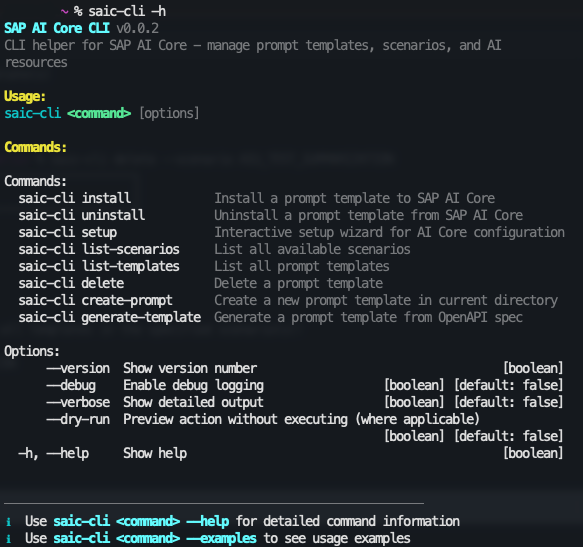

# SAP AI Core CLI (saic-cli)

A TypeScript CLI tool for managing SAP AI Core resources including prompt templates, scenarios, and configurations.

**Currently supported these features, please feel free to open an PR to enhance it.**

Interact with [SAP AI Core APIs](https://api.sap.com/package/SAPAICore/rest)

## Motivation

Managing AI Core resources through SAP AI Launchpad presents several challenges:

- No entry to create custom scenario
- No straightforward way to create, update, or delete prompt templates in bulk
- Repetitive tasks like listing scenarios or managing configurations require multiple UI clicks

This CLI bridges these gaps by providing a **developer-friendly command-line interface**.

## Features



## Quick Start

### 1. Install

```bash
git clone <repo-url>
cd sap-ai-core-cli

# Install dependencies and build. 
npm run install-global
# After finish, run `saic-cli -h` for more information.
```

### 2. Login
Run the interactive setup to connect to AI Core (first-time setup or reconfiguration):

```bash
# Interactive setup
saic-cli setup --sso -a <your_api_endpoint>
# for example saic-cli setup --sso -a https://api.cf.<region>.hana.ondemand.com
```

<details>
<summary>Advanced setup options (SSO, custom CF endpoint)</summary>

```bash
# Setup manually
saic-cli setup

# Pass any cf login arguments
saic-cli setup --sso -o my-org -s my-space
```

All arguments except `--force` and `--reset` are passed directly to the `cf login` command.

</details>
<br>

Reset configuration:
```bash
# Reset configuration
saic-cli setup --reset
```

### 3. Uninstall CLI
```bash
# Uninstall CLI
saic-cli uninstall
```